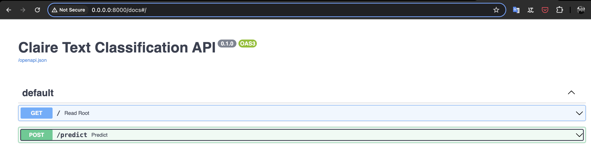
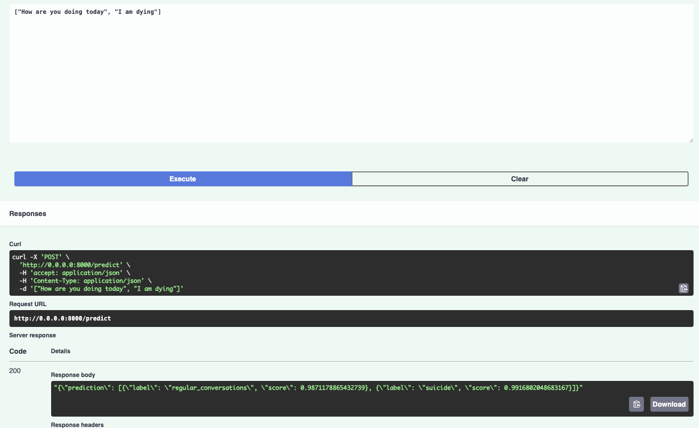

# Question 1

## Part 1
- I chose to synthesize the data for this task. 
- I created a dataset with 5 classes, each representing a different scenario as explained in the task. I used the OpenAI `gpt-3.5-turbo` model for generating the data. You can find the code for generating the data in the `notebooks/data-generation/genereate_data.ipynb` notebook. It contains all the code and a detailed explanation of the process.
- The data quality isn't that great as it was generated using a language model. But it should be good enough to train a model for this task.

- The synthetic data contained a lot of similar exmaples, which would make the model training easier and prone to overfitting.

## Part 2
Instead of using a big LLM like GPT-4 which could classify the conversation scenarios directly, I chose to use a smaller model `distilbert-base-uncased` for this task. I believe that generic models like GPT-4 doesn't won't perform that well on conversations related to mental health out of the box, as they are trained on a wide range of topics.
I fine-tuned the model on the synthesized data. You can find the code for training the model in the `notebooks/training-model/train.ipynb` notebook. It contains all the code and a detailed explanation of the process. There is also a README.md file in the `notebooks/training-model/` directory that answers the questions related to the training process, model selection, and evaluation.

## Part 3
I created a simple API using FastAPI that serves the model. You can find the code for the API in the `api` directory. The API has a single endpoint `/predict` that takes a 

To run the API, you can follow these steps:
1. Install the required packages by running `pip install -r requirements.txt`
2. Make sure docker is installed on your machine
3. Execute the following command to build the docker image:
```bash
docker build -t fast-api-deployment .
```
4. Run the docker container:
```bash
docker run -d -p 8000:8000 fast-api-deployment
```
5. Once the container is running, you can access the API at `http://localhost:8000/docs` in your browser. You can use the Swagger UI to test the API.

It will look like this:



You can then send a `string` or a List of `string` to the `/predict` endpoint to get the predicted scenario number.



So, one can now use this API in their NodeJS/TypeScript backend to get the scenario number for a given conversation.

**Note:** The API returns the class and the probability of the class for each input conversation which can be used to make more informed decisions. I am aware that I was asked to return an integer indicating the scenario number, but I thought it would be more useful to return the class and the probability of the class for each input conversation.
With some small change in the code, one can easily return the integer indicating the scenario number instead of the class and the probability of the class.

The predict function in the `app/main.py` file would look like this:
```
with torch.no_grad():
    tokenized_input = tokenizer(text, padding=True, truncation=True, max_length=512, return_tensors="pt").to(device)
    logits = model(**tokenized_input).logits
    prediction = torch.argmax(logits, dim=1).tolist()
```

### What could be improved?

- Ideally one would want to deploy this API on a cloud service like AWS, GCP, or Azure. This would make the API more accessible and scalable. One could also add more features to the API like authentication, logging, etc. to make it more robust. 

- API could be tied up with a database to store the conversation history and use it to make better predictions. This would also help in making the system more intelligent over time.

- API could be integrated with a CI/CD pipeline to automate the deployment process. This would make the deployment process more efficient and less error-prone.

- API could be monitored using tools like Prometheus and Grafana to keep track of the performance and health of the API. This would help in identifying and fixing issues proactively.
